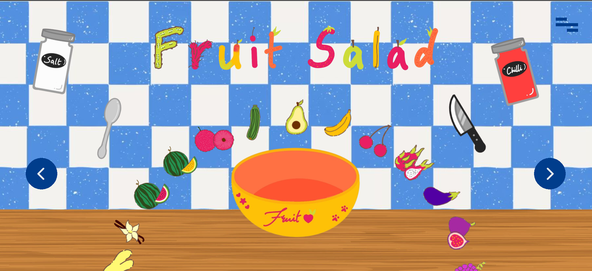
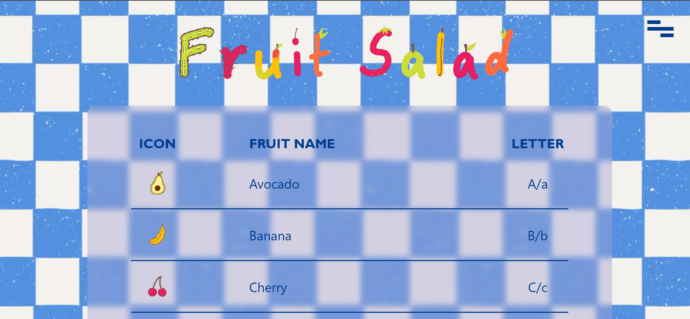
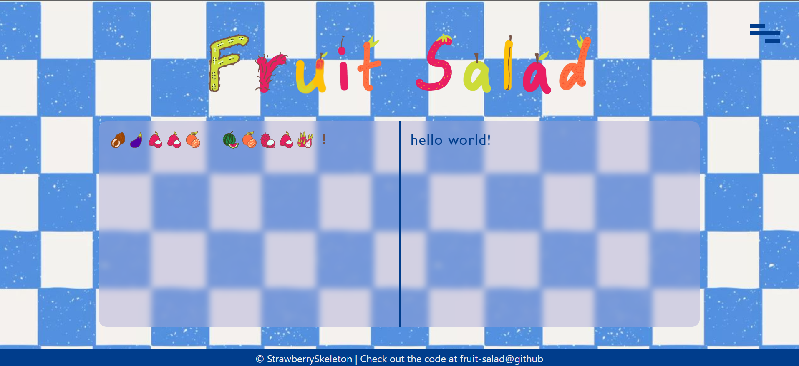
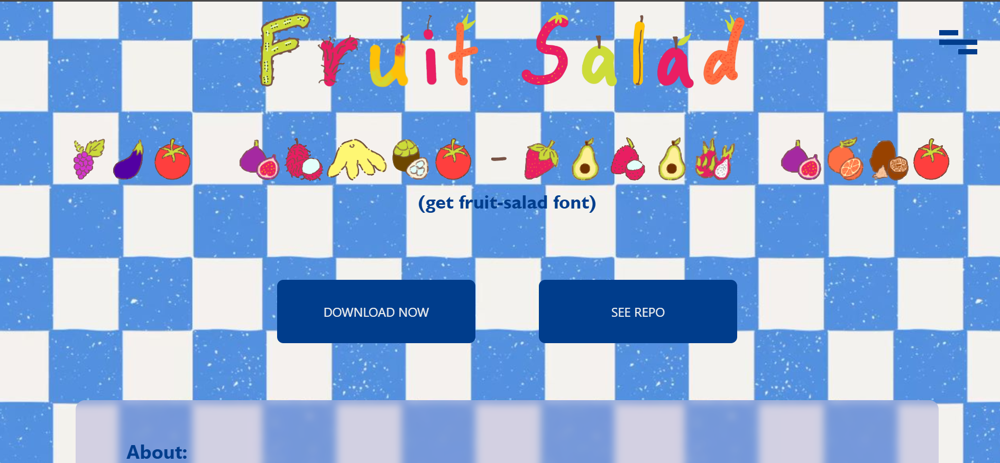
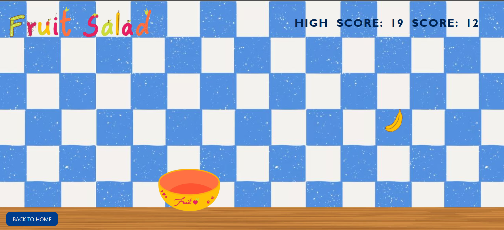

# Fruit Salad
website to showcase my custom made fruit-salad font

## About fruit-salad Font
fruit-salad is a encyrpted font where the starting letter of each fruit represents the letter it is meant to replace (for example: Avocado for A/a). 

> fruit-salad.ttf is a color-glyph svg font in COLR2-svg format. This format isn't that commonly supported yet, but I think it should be ok for most people (no guarantees).

## Making of fruit-salad Font
1. got the idea while eating fruits (mango, yum!!) and thinking about project idea
2. searched google for "fruits name starting with..." a bit too many times to finally create the fruit to letter mappings
3. drew the fruits myself (i did not know i can that well)
4. found out that making a color-svg font is not straightforward at all
5. downloaded multiple free apps to make color-svg font + tried to debug why they were not working.
6. finally ended up using Nanoemoji + Python to make the font (shoutout to chatgpt for misleading-helping me in making the config file)
6. succeeded in making it work for one letter [make png glyph --> remove bg from glyph --> convert to svg --> rename for nanoemoji --> add in config.toml file --> compile the font]. spent around 5-6 days doing the process since free software had limitations
7. started making the website (very long process, but mostly straightforward)
8. drew more assets for the website
9. decided that the website needed a fruit themed catch game --> made that
9. finalized the color scheme + bg + normal text font + other misc designing
10. added final touches + wrote readme

## Features
- HOME PAGE:
    - circle carousel with hover tooltip for the fruits to go around the bowl
    - floating stuff + logo for aesthetics
    - cool menu effect (full page hamburger menu + menu btn animation)
- SEE SALAD -- GUIDE PAGE:
    - guide for the names + picture + letter of each fruit
    - cool blur background + css grid for the container
- MAKE SALAD -- TRY PAGE:
    - for trying out the font in real time
    - type in fruit-salad font --> automatic output in normal font
- ORDER SALAD -- DOWNLOAD PAGE:
    - download font button to directly download the font file
    - link to github repo for this project
    - author's note + about + license section
    - really really cool cursor position-aware button hover effect
- CATCH SALAD -- FRUIT-THEMED CATCH GAME PAGE:
    - catching fruit + moving bowl logic
    - start and end screens
    - score and localStorage stored high schore system

## Project Screenshots

#### Home Page

#### Guide Page

#### Try Page

#### Download Page

#### Catch Game

## Credits
- made by me
- fruit-letter mapping help from my sister
- removing background of all the assets: [https://www.photoroom.com/tools/background-remover](https://www.photoroom.com/tools/background-remover)
- converting png to svg: [https://www.freeconvert.com/png-to-svg](https://www.freeconvert.com/png-to-svg)
- making the font: [Nanoemoji + Python](https://github.com/googlefonts/nanoemoji)
- circle carousel for home page: [https://codepen.io/nicoleat3ve/pen/OJyBoMp](https://codepen.io/nicoleat3ve/pen/OJyBoMp)
- hover button effect for download page: [https://codepen.io/kjbrum/pen/wBBLXx](https://codepen.io/kjbrum/pen/wBBLXx)

> AI USE
> - helped in setting up + debugging for using nanoemoji and python for compiling the font
> - used to find some free apps to make the font (not successful in the end)
> - converting scss code for download btn effect into vanilla css code (online convertors kept showing errors, had to debug the generated code a lot)
> - understanding the circle carousel code
